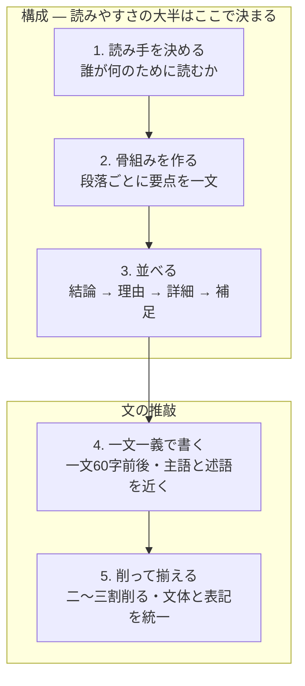

# japanese-writing

読みやすく簡潔で自然な日本語を書く・直す・評価するための Claude Code スキルです。

## このスキルでできること

対象は技術記事、Slack や社内外の連絡文、設計書・仕様書、メール、README、議事録、用語解説、障害や CI 失敗の説明などです。「書いて」「直して」「添削して」「評価して」と頼むと、次のように応えます。

- **書く・直す**: 修正後の全文と、なぜ直したかの理由つきの変更点を返す
- **原因を探す**: 「なんかわかりづらい」と言われたら、指摘を並べず、読み手が最初につまずく箇所を一つ挙げる
- **評価する**: `scripts/check.py` の機械採点（100点）と `references/rubric.md` の採点表（20点）を併用し、次に何を直すかを示す

## 書き方の手順

上から順に進めます。上ほど効きます。読みにくさの原因はたいてい下の「文」ではなく、上の「構成」にあるためです。



## 中身

| ファイル | 役割 |
|---|---|
| `SKILL.md` | スキル本体。書くときの原則と、頼まれたときの応え方 |
| `references/principles.md` | 文章の原則（構成・段落・一文・冗長表現の一覧） |
| `references/rubric.md` | 構成・具体性・自然さの採点表 |
| `references/document-types.md` | 文書の種類ごとの構成とよくある失敗 |
| `scripts/check.py` | 一文の長さ、冗長表現、曖昧語、文体の混在などを機械的に測る |

## check.py の使い方

```bash
python scripts/check.py path/to/text.md
cat text.md | python scripts/check.py
```

行番号つきの指摘と、100点満点の点数が出ます。点数は目安です。スクリプトは文の形しか見ておらず、読みにくさの原因はたいてい構成にあります。`references/rubric.md` の採点表と併用し、食い違ったら採点表を信じてください。

## インストール

このリポジトリを `~/.claude/skills/` 以下に置くと、Claude Code がスキルとして認識します。

```bash
git clone <this-repo> ~/.claude/skills/japanese-writing
```
