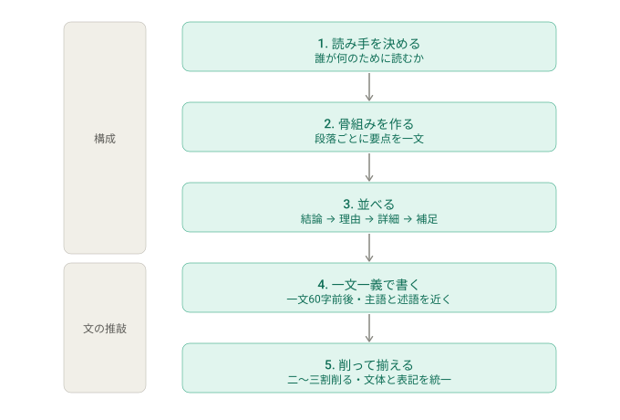

# japanese-writing

読みやすく簡潔で自然な日本語を書く・直す・評価するための Claude Code スキルです。

## このスキルでできること

対象は業務で書く日本語の文章全般です。技術記事、Slack や社内外の連絡文、設計書・仕様書、メール、README、議事録、用語解説、障害や CI 失敗の説明を扱います。「書いて」「直して」「添削して」「評価して」と頼むと、次のように応えます。

- **書く・直す**: 修正後の全文と、なぜ直したかの理由つきの変更点を返す
- **原因を探す**: 「なんかわかりづらい」と言われたら、指摘を並べず、読み手が最初につまずく箇所を一つ挙げる
- **評価する**: `scripts/check.py` の機械採点（100点）と `references/rubric.md` の採点表（20点）を併用し、次に何を直すかを示す

## 書き方の手順

読みにくさの原因は、たいてい個々の文ではなく全体の構成にあります。上のステップほど直したときの効果が大きいのは、そのためです。手順も上から順に進めます。



## 中身

| ファイル | 役割 |
|---|---|
| `SKILL.md` | スキル本体。毎回読む原則と、頼まれたときの応え方。詳細は下の references に委ねる |
| `references/principles.md` | 文章の原則（構成・目次と太字・原因の書き方・一文・具体例・冗長表現の一覧） |
| `references/diagnosis.md` | 「わかりづらい」と言われたときに根本原因を一つ探す手順と、疑う順番 |
| `references/rubric.md` | 構成・具体性・自然さの採点表 |
| `references/document-types.md` | 文書の種類ごとの構成とよくある失敗 |
| `references/diagrams.md` | 図・表・文の使い分けと、Mermaid で図を書くときの型 |
| `scripts/check.py` | 一文の長さ、読点や漢字の連続、冗長表現、曖昧語と推測表現、文体の混在、表記などを機械的に測る |

## check.py の使い方

```bash
python3 scripts/check.py path/to/text.md
cat text.md | python3 scripts/check.py
```

行番号つきの指摘と、100点満点の点数が出ます。100点は「指摘なし」の意味で、指摘が一つでもあれば100点にはなりません。回帰テストは `python3 scripts/test_check.py` で実行できます。点数は目安です。スクリプトは文の形しか見ておらず、読みにくさの原因はたいてい構成にあります。`references/rubric.md` の採点表と併用し、食い違ったら採点表を信じてください。

## 自動チェック（GitHub Actions）

このリポジトリの PR では、2つのワークフローが `scripts/check.py` を自動で回してコメントします。どちらもワークフロー自体は失敗させず、点数は目安として出すだけです。`check.py` 自体の回帰テストは `test-check` が回し、こちらは失敗すると赤くなります。

| ワークフロー | 対象 | きっかけ |
|---|---|---|
| `pr-body-check` | PR の本文 | PR を開いた / 本文を編集した |
| `pr-docs-check` | PR で変更した Markdown | PR を開いた / コミットを追加した |
| `test-check` | `scripts/check.py` の回帰テスト | すべての PR / main への push |

## スキルの効果を測る

`evals/evals.json` に3つの試験文（Slack 連絡文の添削、用語解説の「なぜわかりづらい」、CI 失敗説明の点数評価）と、18項目の採点条件があります。`evals/run_models.py` は、この試験文をスキルあり・なしの両方で `claude -p` に流し、回答と費用を保存します。

```bash
python3 evals/run_models.py --out /tmp/jw-evals claude-sonnet-5 claude-haiku-4-5-20251001
```

採点は、保存された回答を採点条件と一緒に Claude に読ませて行います。2026年9月に Fable 5.1、Sonnet 5、Haiku 4.5 で測ったところ、18項目の合格数はスキルなしで 6〜9、スキルありで 16〜17 でした。

## インストール

このスキルは [Agent Skills](https://agentskills.io) の形式（`SKILL.md` + `references/` + `scripts/`）なので、Claude Code と Cursor の両方でそのまま使えます。リポジトリを一度 clone し、各ツールが読むディレクトリからシンボリックリンクを張ります。

```bash
git clone git@github.com:masamasamasato/japanese-writing.git ~/japanese-writing
```

### Claude Code

```bash
mkdir -p ~/.claude/skills && ln -sfn ~/japanese-writing ~/.claude/skills/japanese-writing
```

### Cursor

Cursor は `~/.cursor/skills/` と `~/.agents/skills/` に加え、互換のため `~/.claude/skills/` も読みます。Claude Code の設定だけでも動きますが、明示するなら次を実行します。

```bash
mkdir -p ~/.cursor/skills && ln -sfn ~/japanese-writing ~/.cursor/skills/japanese-writing
```

プロジェクト単位で使うなら、リポジトリ内の `.cursor/skills/japanese-writing/` に置いても認識されます。

どちらのツールでも、更新は `~/japanese-writing` で `git pull` するだけです。
